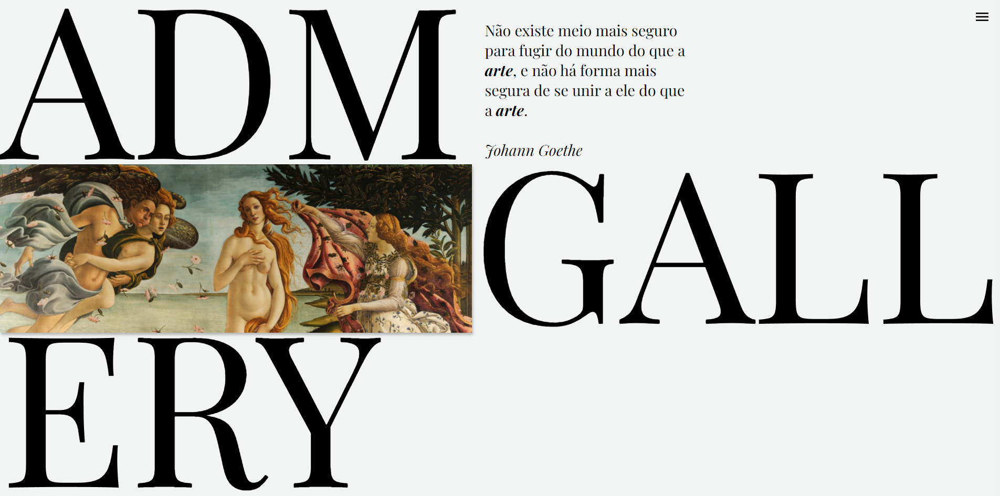

<h1 align="center"> ADM Gallery </h1>

    

# Sobre o Projeto

Projeto de capacitação em React e Ruby on Rails criado pela Diretoria Administrativa - Financeira da Struct e concluído em 17 de agosto de 2021. Essa capacitação ocorreu devido a transição no uso de Rails Full-Stack para o uso da biblioteca React (front-end) em conjunto com Ruby on Rails (back-end).

O projeto ADM Gallery tem como objetivo a democratização do acesso à arte, fornecendo um pletora de diversas pinturas de diferentes décadas e artistas, junto com informações e curiosidades sobre as obras mais celebradas da história. Para a adição ou remoção do conteúdo visual das páginas, o site possui uma página de Login e Logout para o acesso do administrador.

Para acessar o site completo será necessário fazer uso da api em Rails localizada em [adm_galery-api](https://github.com/StructCE/adm_galery-api). 

## Membros responsáveis pelo projeto:
* [André Macedo](https://github.com/andremacedopv)
* [David Mendes](https://github.com/DavidsonGM)
* [Nícolas Paulin](https://github.com/iIiqwertyiIi)

# Requisitos e ferramentas utilizadas
* [Node](https://nodejs.org/en/download/) (v16.16.0)
* [Yarn](https://classic.yarnpkg.com/lang/en/docs/install/#windows-stable)
* [Git](https://git-scm.com/downloads)

# Como clonar e rodar o projeto em sua máquina
### `git clone https://github.com/StructCE/adm_gallery-site.git`
Clona o repositório para uso local em seu computador.

### `yarn` ou `yarn install`
Instala todas as dependências e módulos do arquivo package.json necessários para o rodar o projeto react.

Caso o erro `ERR_OSSL_EVP_UNSUPPORTED webpack` surja, a sua versão do node pode ser diferente da versão do projeto. Nesse caso digite no terminal `nvm use 16.16.0` e tente instalar as dependências novamente.

### `yarn start`
Roda o projeto em modo de desenvolvedor.

Abra [http://localhost:3000](http://localhost:3000) para visualizar o projeto em seu navegador padrão.

A página vai recarregar se você fizer qualquer edição e erros no código serão exibidos no terminal.

